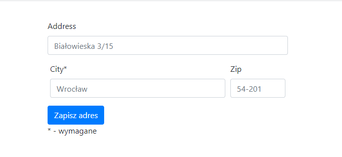
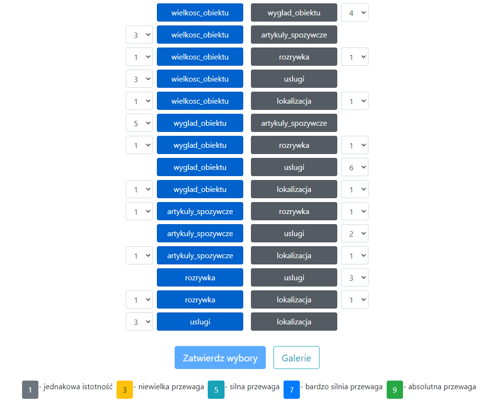
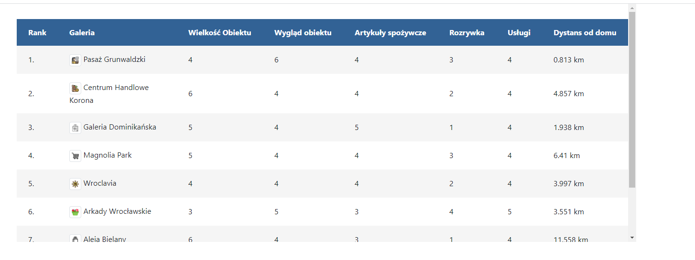

# galerie
Aplikacja wspomagająca wybór galerii z wykorzystaniem metody AHP i Electre

Galerie na których się skupiamy:

Każda galeria ma ocenę kryteriów przez eksperta:

Od uzytkownika pobierany jest adres:

Następnie uzytkownik pytany jest o preferencje co ceni sobie bardziej i w jakim stopniu (15 porównań):

Aplikacja wykrozystuje API GoogleMaps do obliczenia odległości pomiędzy adresem użytkownika a galeriami.
Metoda AHP (biblioteka ahpy) na podstawie wybranych preferencji wyznacza potrzebne wagi kryteriów.
Metoda Electre dopasowuje kryteria galerii za pomocą wyliczonych wag i tworzy ranking galerii.

